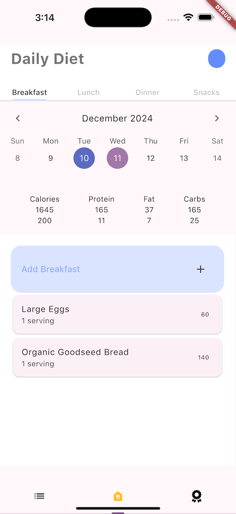
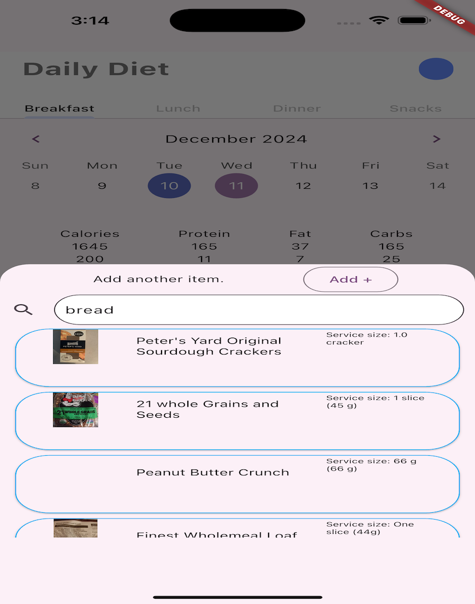
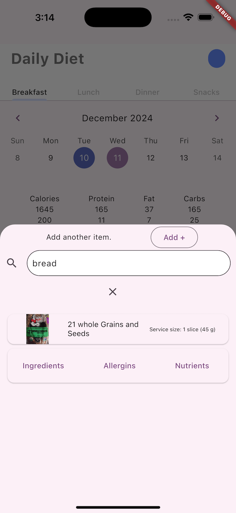
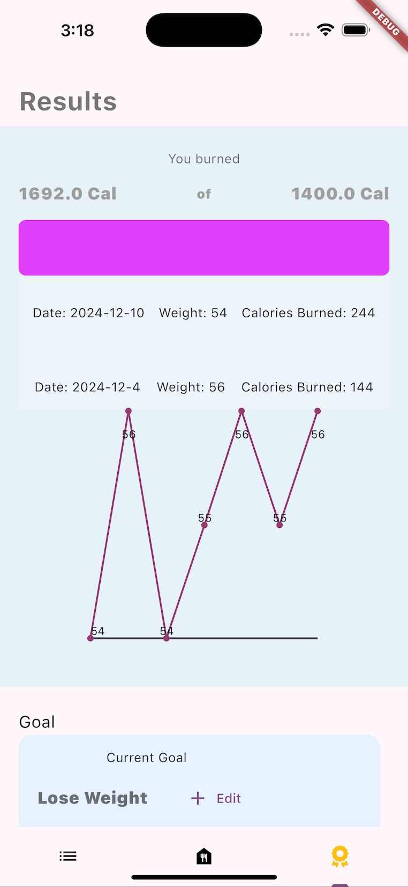

# FitnessApp - Complete Health & Nutrition Tracker

A comprehensive Flutter mobile application for fitness enthusiasts to track their nutrition, workouts, goals, and health metrics. Built with modern architecture principles and leveraging Firebase for backend services.

## 🏗️ Architecture

This app follows **Clean Architecture** principles with feature-based organization:

- **State Management**: Hooks Riverpod + Flutter Hooks
- **Backend**: Firebase (Firestore, Auth) 
- **Local Storage**: Hive for offline persistence
- **Nutrition Data**: OpenFoodFacts API integration
- **Health Integration**: Health package for device health data
- **Error Handling**: FpDart with Either type for functional programming
- **Navigation**: GoRouter for declarative routing

## 📱 App Screenshots

### Daily Diet Tracking
Track your daily nutrition with detailed macro breakdowns and calendar-based meal planning.



### Food Search & Selection
Search and add food items with detailed nutritional information from OpenFoodFacts database.




### Results & Progress Tracking
Monitor your progress with weight tracking charts and calorie burn analysis.



## ✨ Current Features

### 🍽️ Nutrition Tracking
- **Daily meal planning** with breakfast, lunch, dinner, and snacks
- **Macro tracking** (calories, protein, fat, carbs) with real-time calculations
- **Calendar integration** for viewing historical nutrition data
- **Food database search** powered by OpenFoodFacts API
- **Serving size adjustments** with automatic macro recalculation

### 📊 Progress & Results
- **Weight tracking** with visual line charts showing fluctuations over time
- **Calorie burn monitoring** with goal vs actual comparisons
- **Progress visualization** with interactive charts
- **Goal setting and tracking** with customizable targets

### 🏋️ Workout Programs
- **Pre-built workout programs** for different fitness levels
- **Exercise categorization**: Cardio, Upper Body, Lower Body
- **Workout suggestions** based on user preferences
- **Exercise tracking** and progress monitoring

### 👤 Profile Management  
- **User authentication** with Firebase Auth (email/password)
- **Personal goal management** and history
- **Saved recipes** for quick meal logging
- **User preferences** and settings

### 📱 Additional Features
- **Comprehensive onboarding** flow for new users
- **Responsive UI** with modern design patterns
- **Offline support** with Hive local storage
- **Device health integration** capabilities
- **Camera integration** for future photo features

## 🚀 Getting Started

### Prerequisites
- Flutter SDK ^3.9.0
- Firebase project setup
- iOS/Android development environment

### Installation

1. **Clone the repository**
   ```bash
   git clone https://github.com/ItsYaBoyJG/FitnessApp.git
   cd FitnessApp/fitness_app
   ```

2. **Install dependencies**
   ```bash
   flutter pub get
   ```

3. **Generate code for models**
   ```bash
   flutter packages pub run build_runner build --delete-conflicting-outputs
   ```

4. **Run the app**
   ```bash
   flutter run
   ```

### Development Commands
```bash
# Install dependencies
flutter pub get

# Code generation (run after model changes)
flutter packages pub run build_runner build

# Run app on specific device
flutter run -d <device-id>

# Build for production
flutter build apk          # Android
flutter build ios          # iOS

# Testing and analysis
flutter test               # Run tests
flutter analyze           # Static analysis
flutter clean             # Clean build artifacts
```

## 🏗️ Project Structure

The app follows Clean Architecture with clear separation of concerns:

```
lib/
├── core/                  # Core functionality
│   ├── constants/         # App-wide constants
│   ├── errors/           # Error handling
│   ├── network/          # Network utilities
│   ├── providers/        # Dependency injection
│   └── usecases/         # Base use case interface
├── features/             # Feature modules
│   ├── authentication/   # User auth (Clean Architecture)
│   ├── nutrition/        # Nutrition tracking
│   ├── workout/          # Exercise tracking
│   └── profile/          # User profile
├── shared/               # Shared components
│   ├── themes/           # App theming
│   └── widgets/          # Reusable widgets
└── view/ (legacy)        # Legacy UI components
```

## 🔧 Technologies Used

- **Flutter** - Cross-platform mobile development
- **Hooks Riverpod** - State management and dependency injection
- **Firebase Firestore** - Cloud database
- **Firebase Auth** - User authentication  
- **Hive** - Local storage and offline support
- **OpenFoodFacts API** - Nutrition database
- **Health Package** - Device health data integration
- **GoRouter** - Declarative navigation
- **FL Chart** - Data visualization
- **FpDart** - Functional programming utilities

## 🚧 Development Status

### ✅ Completed Features
- Complete nutrition tracking with macro calculations
- Weight and progress tracking with charts  
- User authentication and profile management
- Food database integration with search
- Workout program suggestions
- Clean architecture foundation
- Offline data persistence

### 🔄 In Progress
- Migration from legacy views to Clean Architecture
- Enhanced workout tracking with exercise logging
- Improved error handling and user feedback
- Performance optimizations

### 📋 Upcoming Features
- [ ] Social features (friends list, following)
- [ ] Automatic health data sync from device sensors
- [ ] Advanced chart customization for macro/micro nutrients
- [ ] Enhanced profile with public sharing capabilities
- [ ] Photo integration with Firebase Storage
- [ ] Meal planning and recipe recommendations
- [ ] Workout routine customization
- [ ] Achievement system and badges
- [ ] Export data functionality

## 🤝 Contributing

Contributions are welcome! Please feel free to submit a Pull Request.

## 📄 License

This project is open source and available under the [MIT License](LICENSE).

---

*This is an ongoing project showcasing modern Flutter development practices with Clean Architecture, state management, and Firebase integration.*